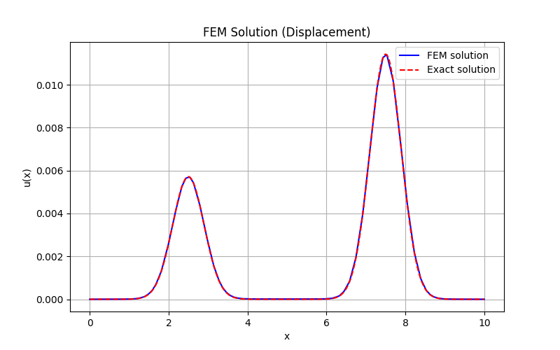
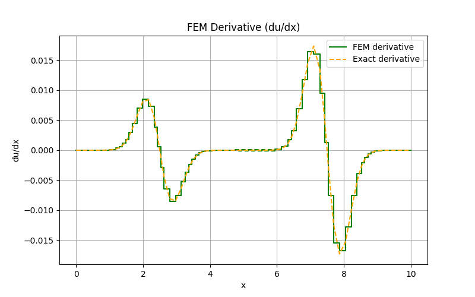

# HiDeNN-FEM: Differentiable Piecewise-Linear Finite Element Networks in PyTorch

This repository provides a PyTorch implementation of **Hierarchical Deep-Learning Neural Networks (HiDeNN)** for the **Finite Element Method (FEM)**, based on  
> *Zhang et al., “Hierarchical Deep-Learning Neural Networks: Finite Elements and Beyond”, Computational Mechanics, 2021.*

The project reproduces, in a minimal and fully differentiable framework, the **HiDeNN-FEM formulation**, where **neural network blocks are defined as functions of nodal coordinates and nodal values**.  
All computations are vectorized and GPU-compatible, enabling automatic differentiation of finite-element interpolation and its derivatives via PyTorch’s autograd.

---

## Technical Approach

The HiDeNN-FEM framework reformulates finite-element interpolation as a **structured neural network**.  
In this implementation:

- Each **piecewise-linear DNN block** represents the local interpolation function (1D or 2D).  
- The **network parameters** correspond directly to **nodal coordinates** and **nodal values**, allowing gradient-based *r-adaptivity*.  
- Elementwise derivatives (e.g., ∂u/∂x) are obtained automatically through autograd, without symbolic differentiation.  
- Numerical integration in weak formulations uses Gaussian quadrature with differentiable losses.

This setup provides a differentiable and lightweight bridge between classical FEM and deep learning.

---

## Reproducible Examples

Each example is self-contained and reproducible.  
Run them from the project root:

```bash
python -m examples.example1   # Weak formulation (1D bar under stress)
python -m examples.example2   # 1D L2 projection
python -m examples.example3   # 2D L2 projection
```
# HiDeNN-FEM Examples

This repository provides examples of using the **HiDeNN-FEM** model for 1D and 2D problems, demonstrating differentiable finite element methods and r-adaptivity.

---

## Example 1 — 1D Bar Under Stress (Weak Formulation)

Minimization of the total potential energy:

$$
\Pi(u) = \int \frac{E \left( \frac{du}{dx} \right)^2}{2} - f \, u \, dx
$$

using the HiDeNN-FEM model. This reproduces the 1D numerical example presented in **Zhang et al., 2021**.
    |

<p float="left">
  
  
</p>

---

## Example 2 — 1D $L^2$ Projection

Tests the HiDeNN-FEM interpolant as a regression operator between a reference function $u_{\text{true}}$ and its projection $u_h$.

---

## Example 3 — 2D $L^2$ Projection

Extends the same formulation to a 2D tensor-product grid.  
Demonstrates differentiable 2D interpolation and visualization of the predicted field and its derivatives.

---

## Key References

1. Zhang, L., Cheng, L., Li, H., Gao, J., Yu, C., Domel, R., Yang, Y., Tang, S., & Liu, W. K. (2021).  
   *Hierarchical Deep-Learning Neural Networks: Finite Elements and Beyond.*  
   Computational Mechanics, 67, 207–230. doi:[10.1007/s00466-020-01928-9](https://doi.org/10.1007/s00466-020-01928-9)

2. Sourav Saha, Zhengtao Gan, Lin Cheng, Jiaying Gao, Orion L. Kafka, Xiaoyu Xie, Hengyang Li, Mahsa Tajdari, H. Alicia Kim, Wing Kam Liu.
*Hierarchical Deep Learning Neural Network (HiDeNN): An artificial intelligence (AI) framework for computational science and engineering,
Computer Methods in Applied Mechanics and Engineering*

3. Park, C., Saha, S., Guo, J. et al.  *Unifying machine learning and interpolation theory via interpolating neural networks*

4. Park, C., Lu, Y., Saha, S. et al. *Convolution hierarchical deep-learning neural network (C-HiDeNN) with graphics processing unit (GPU) acceleration*


