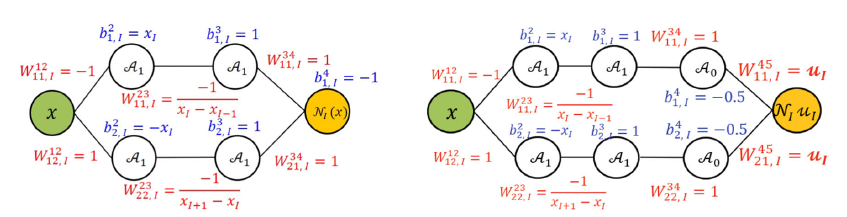
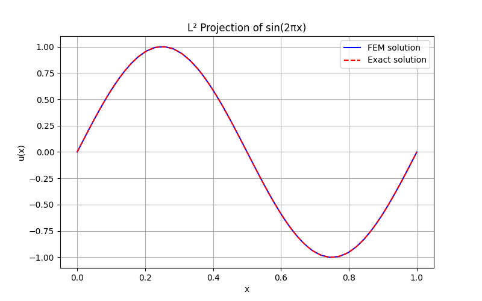
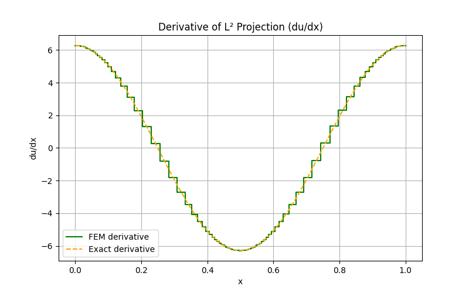
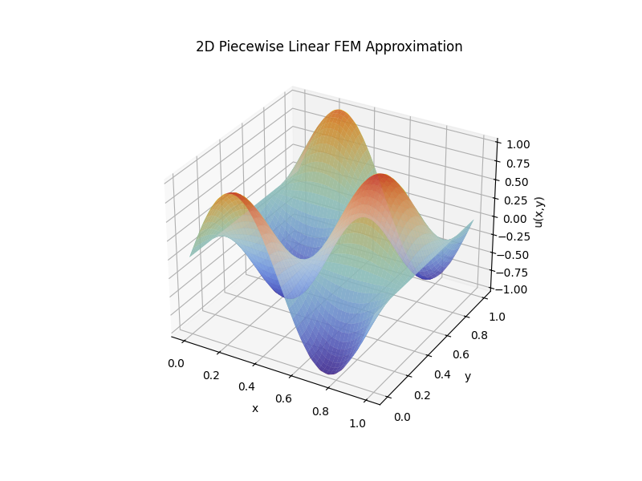
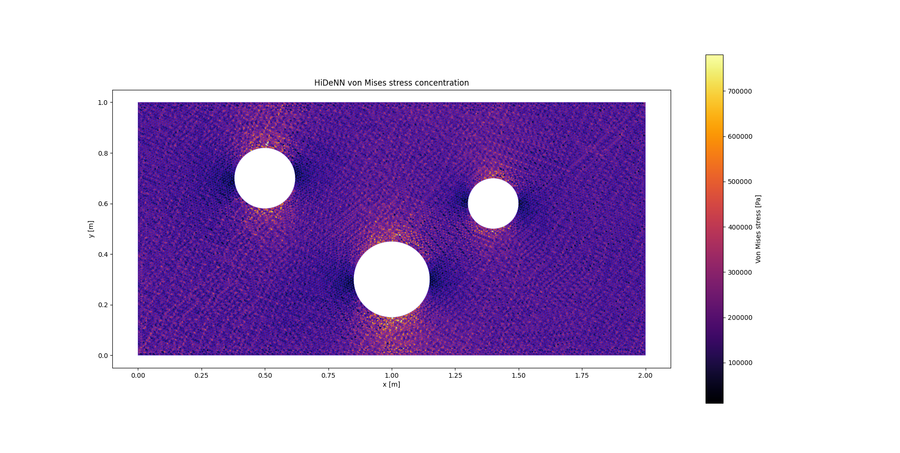

# HiDeNN-FEM: Hierarchical Deep Learning Neural Networks for Finite Element Method

[](https://www.python.org/downloads/)
[](https://pytorch.org/)
[](LICENSE)

A Python implementation of the Hierarchical Deep-learning Neural Network (HiDeNN) framework for solving partial differential equations using finite element methods with deep neural networks and r-adaptivity.

## Table of Contents

- [Overview](#overview)
- [Motivation](#motivation)
- [HiDeNN-FEM Framework](#hidenn-fem-framework)
  - [Classical vs DNN-Based Formulation](#classical-vs-dnn-based-formulation)
  - [Element-Based Reference](#element-based-reference)
  - [Derivatives and r-Adaptivity](#derivatives-and-r-adaptivity)
- [Problem Settings](#problem-settings)
  - [L² Projection](#l²-projection)
  - [Linear Elasticity](#linear-elasticity)
- [Implementation](#implementation)
  - [Features](#features)
  - [Model Construction](#model-construction)
  - [Installation](#installation)
- [Numerical Examples](#numerical-examples)
  - [Example 1: 1D L² Projection](#example-1-1d-l²-projection)
  - [Example 2: 2D L² Projection](#example-2-2d-l²-projection)
  - [Example 3: 1D Bar under Body Force](#example-3-1d-bar-under-body-force)
  - [Example 4: 2D Plate under Traction](#example-4-2d-plate-under-traction)
- [Repository Structure](#repository-structure)
- [References](#references)

## Overview

Solving partial differential equations (PDEs) with deep learning has gained significant attention due to the flexibility of neural networks and their theoretical foundation provided by the universal approximation theorem. This project implements the Hierarchical Deep-learning Neural Network (HiDeNN) framework, which unifies classical numerical methods with deep neural networks in a hierarchical manner, with particular emphasis on the finite element method (HiDeNN-FEM).

The implementation provides a complete Python framework leveraging PyTorch and GPU acceleration, supporting both 1D and 2D problems with structured and unstructured meshes. The technical approach involves representing finite element shape functions with deep neural networks, using an element-based reference formulation and Jacobian transformations, and enabling **r-adaptivity** through the optimization of nodal coordinates.

## Motivation

Traditional finite element methods (FEM) solve PDEs by discretizing the domain with a fixed mesh and assembling a stiffness matrix. While robust, this approach offers limited flexibility in mesh adaptation and integration with modern machine learning tools.

HiDeNN-FEM addresses these limitations by:
- **Representing FEM shape functions as structured DNNs** where weights and biases are functions of nodal coordinates and values
- **Enabling r-adaptivity**: optimizing both nodal values and positions to capture singularities and improve accuracy
- **Leveraging GPU acceleration** and automatic differentiation from deep learning frameworks
- **Strongly enforcing boundary conditions** directly in the model parameters
- **Unifying various numerical methods** under a single neural network framework

When nodal coordinates are frozen, HiDeNN-FEM is equivalent to classical FEM on a fixed mesh. When coordinates are optimized, the mesh adapts to better capture physical phenomena like stress concentrations.

## HiDeNN-FEM Framework

### Classical vs DNN-Based Formulation

In classical FEM with linear interpolation, the global approximation $u_h(x)$ is constructed using nodal shape functions:

```math
u_h(x) = \sum_{I=1}^{n} N_I(x) u_I
```

where $N_I(x)$ is a piecewise linear function supported on $[x_{I-1}, x_{I+1}]$.

In HiDeNN-FEM, this shape function is represented using ReLU activations:

```math
N_I(x;W,b) = \text{ReLU}\left(\frac{-1}{x_I - x_{I-1}}\text{ReLU}(-x + x_I) + 1\right) + \text{ReLU}\left(\frac{-1}{x_{I+1} - x_I}\text{ReLU}(x - x_I) + 1\right) - 1
```


*Figure (from [Zhang et al., 2021]): (a) DNN representation of the global linear shape function $N_I(x)$, (b) DNN representation of the nodal interpolation $u_I^h(x)$*

### Element-Based Reference

For efficient computation, especially in 2D/3D meshes, the implementation uses an **element-based reference formulation** rather than global shape functions. For any input point $x$, shape functions are defined only on the element containing $x$, avoiding the need to evaluate all $n$ nodal shape functions.

**Key idea**: The model input is a tuple $(x, \text{id}(x))$ consisting of:
- Physical coordinate(s) $x$
- Element ID containing $x$

The loss function typically involves integrals:

```math
L(\theta) = \int_\Omega l(x;\theta) dx
```

These are evaluated using Gaussian quadrature element-wise, where only the local shape functions of each element are computed. This significantly reduces computational cost and naturally extends to unstructured meshes.

### Derivatives and r-Adaptivity

Computing derivatives of shape functions with respect to physical coordinates is essential for:
1. Evaluating PDE residuals and energy functionals
2. Enabling **r-adaptivity**: optimizing nodal positions by backpropagating through the Jacobian


*Figure (from [Lui et al., 2023]): Three building blocks for computing shape function derivatives: partial derivative operator $D_N$, r-adaptive block (Jacobian), and material derivatives*

The derivative computation involves three blocks:

1. **Partial derivative operator $D_N$**: shape function derivatives w.r.t. reference coordinates
2. **r-Adaptive block (Jacobian)**: mapping from reference to physical coordinates
3. **Material derivatives**: shape function derivatives w.r.t. physical coordinates via chain rule:

```math
\frac{\partial N}{\partial x} = J^{-1} \cdot D_N
```

Since the Jacobian $J$ depends on nodal coordinates, gradients of the loss function w.r.t. nodal positions flow through this block, enabling mesh optimization.

## Problem Settings

### L² Projection

The L² projection finds the best approximation of a target function $u_{\text{true}}$ in the finite element space by minimizing:

```math
L(v) = \int_\Omega (v - u_{\text{true}})^2 dx
```

This problem validates the interpolation and differentiation mechanisms. The integral is approximated using:
- Uniform grid sampling for structured meshes
- Monte Carlo sampling for general domains

### Linear Elasticity

Linear elasticity problems are solved by minimizing the **total potential energy functional**:

```math
L_p(u) = \int_\Omega \frac{1}{2} \varepsilon(u) : \mathbf{C} : \varepsilon(u) d\Omega - \int_\Omega \mathbf{f} \cdot \mathbf{u} d\Omega - \int_{\partial\Omega_N} \mathbf{t} \cdot \mathbf{u} dS
```

where:
- $\varepsilon(u) = \frac{1}{2}(\nabla u + (\nabla u)^T)$ is the strain tensor
- $\mathbf{C}$ is the stiffness tensor
- $\mathbf{f}$ is the body force
- $\mathbf{t}$ is the prescribed traction

#### 1D Bar Problem

A bar fixed at both ends subjected to distributed Gaussian-type body forces:

```math
\frac{d}{dx}\left(AE\frac{du}{dx}\right) + b(x) = 0, \quad x \in [0,10]
```

with $u(0) = u(10) = 0$.

#### 2D Plate with Holes

A rectangular plate (2m × 1m) with three circular holes under plane stress conditions. Left boundary fixed, uniform tensile load (100 kN) on the right boundary. Material: $E = 10$ GPa, $\nu = 0.3$.

## Implementation

### Features

- **Mesh Support**: Structured Cartesian grids (1D, 2D) and unstructured triangular meshes
- **GPU Acceleration**: Full vectorization with PyTorch and CUDA
- **Automatic Differentiation**: Gradient computation via PyTorch autograd
- **Boundary Conditions**: Strong enforcement through parameter masking
  - Geometric masks: freeze boundary node coordinates
  - Dirichlet masks: freeze and set boundary values
  - Neumann conditions: integrated via boundary element connectivity
- **r-Adaptivity**: Joint optimization of nodal coordinates and values
- **Mesh Generation**: Integration with `gmsh` for complex geometries

### Model Construction

#### DNN-Based Model Initialization

The model takes an initial mesh and creates a DNN representation where:
- **Parameters**: nodal coordinates and nodal values (trainable)
- **Input**: evaluation points $X_{\text{eval}} \in \mathbb{R}^{m \times \text{dim}(x)}$
- **Output**: interpolated function $u^h(X_{\text{eval}})$

All operations are fully vectorized for batch processing on GPU.

#### Structured vs Triangular Meshes

**Structured Cartesian Mesh**: To prevent element inversion during coordinate optimization, the mesh is parameterized through increments between nodes rather than absolute positions. Positivity is enforced via softplus activation, and cumulative sum restores nodal positions.

**Triangular Mesh**: Uses a connectivity table mapping element IDs to node indices. Input format:

```math
X_{\text{eval}} = (X, \text{id}(X)) \in \mathbb{R}^{m \times (\text{dim}(x)+1)}
```

The forward pass returns both $u^h(X_{\text{eval}})$ and $\det(J)$ needed for integration.

#### Derivatives and Loss Evaluation

For physics-informed losses, the model computes:
- Derivatives $\nabla u^h$ following the three-block approach (Section: Derivatives and r-Adaptivity)
- Alternatively, PyTorch `autograd.grad` can compute gradients w.r.t. input coordinates directly

### Installation

```bash
# Clone the repository
git clone https://github.com/achraf-15/HiDeNN-FEM.git
cd HiDeNN-FEM

# Install dependencies
pip install -r requirements.txt
```

**Requirements**:
- Python 3.8+
- PyTorch 2.0+
- NumPy
- Matplotlib
- gmsh 
- meshzoo

## Numerical Examples

All examples can be run directly from the repository root:

```bash
python -m examples.example1  # 1D L² projection
python -m examples.example2  # 2D L² projection
python -m examples.example3  # 1D bar under body force
python -m examples.example4  # 2D plate under traction
```

### Example 1: 1D L² Projection

This example demonstrates the 1D L² projection problem. The model evaluates both the function and its derivatives using `autograd.grad`.

<p align="center">
  
  
</p>

*Figure: 1D L² projection - (left) model output $u^h(x)$, (right) derivative $\frac{du^h}{dx}$ computed via autograd*

### Example 2: 2D L² Projection

This example extends the L² projection to two dimensions. Both partial derivatives $\frac{\partial u^h}{\partial x}$ and $\frac{\partial u^h}{\partial y}$ are computed directly with `autograd.grad`.

<p align="center">
  
</p>

*Figure: 2D L² projection - model output $u^h(x,y)$*

<p align="center">
  
</p>

*Figure: 2D L² projection - partial derivatives $\frac{\partial u^h}{\partial x}$ and $\frac{\partial u^h}{\partial y}$*

### Example 3: 1D Bar under Body Force

This example solves the 1D linear elasticity problem of a bar under localized Gaussian body forces. The r-adaptivity moves nodes to better align with regions of high gradients.

<p align="center">
  
  
</p>

*Figure: 1D bar under body force - (left) displacement $u^h(x)$, (right) derivative $\frac{du^h}{dx}$. R-adaptivity concentrates nodes near force application points.*

### Example 4: 2D Plate under Traction

For the 2D plate with holes, two optimizers were tested:
- **Adam**: First-order gradient-based optimizer - fails to capture stress concentrations
- **LBFGS**: Quasi-Newton optimizer - converges faster and correctly captures Von-Mises stress concentration patterns

The difficulty arises from the non-linear and non-convex optimization landscape with respect to nodal coordinates, which depends on $\det(J)$ and $J^{-1}$. Degenerate triangles with very small $\det(J)$ can produce gradient spikes.

<p align="center">
  
</p>

*Figure: Displacement field $u^h$ using LBFGS optimizer*

<p align="center">
  
</p>

*Figure: Von-Mises stress concentration $\sigma_{\text{VM}}$. Stress concentrations around holes are accurately captured due to r-adaptivity and optimizer choice.*

## Repository Structure

```
.
├── examples/
│   ├── example1.py          # 1D L² projection
│   ├── example2.py          # 2D L² projection
│   ├── example3.py          # 1D bar under body force
│   └── example4.py          # 2D plate under traction
├── src/                     # Source code
│   ├── model.py             # HiDeNN-FEM model implementation
│   ├── mesh.py              # Mesh generation and utilities
│   ├── loss.py              # Loss functions
|   ├── plots.py             # Plot functions
│   └── utils.py             # Helper functions
├── figures/                 
├── README.md
└── requirements.txt
```

## Key References

1. **Zhang, L., Cheng, L., Li, H., Gao, J., Yu, C., Domel, R., Yang, Y., Tang, S., & Liu, W. K.** (2021). Hierarchical deep-learning neural networks: Finite elements and beyond. *Computational Mechanics*, 67(1), 207-230.

2. **Saha, S., Gan, Z., Cheng, L., Gao, J., Kafka, O. L., Xie, X., Li, H., Tajdari, M., Kim, H. A., & Liu, W. K.** (2021). Hierarchical Deep Learning Neural Network (HiDeNN): An artificial intelligence (AI) framework for computational science and engineering. *Computer Methods in Applied Mechanics and Engineering*, 373, 113452.

3. **Liu, Y., Park, C., Lu, Y., Mojumder, S., Liu, W. K., & Qian, D.** (2023). HiDeNN-FEM: A seamless machine learning approach to nonlinear finite element analysis. *Computational Mechanics*, 72(1), 173-194.

4. **Škardová, K., Daby-Seesaram, A., & Genet, M.** (2025). Finite Element Neural Network Interpolation. Part I: Interpretable and Adaptive Discretization for Solving PDEs. *Computational Mechanics*.

5. **E, W., & Yu, B.** (2018). The Deep Ritz Method: A Deep Learning-Based Numerical Algorithm for Solving Variational Problems. *Communications in Mathematics and Statistics*, 6(1), 1-12.

6. **Raissi, M., Perdikaris, P., & Karniadakis, G. E.** (2019). Physics-informed neural networks: A deep learning framework for solving forward and inverse problems involving nonlinear partial differential equations. *Journal of Computational Physics*, 378, 686-707.

7. **Park, C., Lu, Y., Saha, S., Xue, T., Guo, J., Mojumder, S., Apley, D. W., Wagner, G. J., & Liu, W. K.** (2023). Convolution hierarchical deep-learning neural network (C-HiDeNN) with graphics processing unit (GPU) acceleration. *Computational Mechanics*, 72(2), 383-409.

---

**Author**: Achraf Msaddak  
**Date**: November 2025  
**License**: MIT